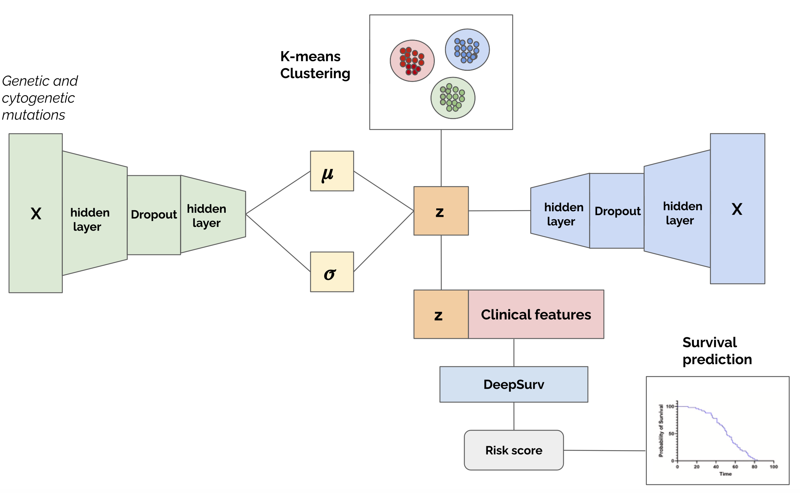

# VAE-Surv: Variational Autoencoder for Survival Analysis

## Introduction

**VAE-Surv** integrates a **Variational Autoencoder (VAE)** with a **survival prediction model** to identify patient subgroups and predict survival outcomes. Originally developed for **Myelodysplastic Syndromes (MDS)** patients, it can be applied to various biomedical datasets. The VAE reduces high-dimensional molecular data to a **latent space**, which is then used alongside clinical features in a **Cox neural network** for survival analysis.

### Key Features:
- **Dimensionality Reduction**: Extracts a meaningful latent representation from high-dimensional genomic data.
- **Survival Prediction**: Uses a deep Cox network to model survival risk.
- **Patient Clustering**: Performs unsupervised clustering in the latent space to identify distinct prognostic groups.
- **Joint Training**: Optimizes both reconstruction (VAE) and survival loss to enhance predictive performance.

The repository includes an example on the **METABRIC breast cancer dataset**, but the model is designed to work with any structured biomedical dataset containing molecular and clinical features.
The schematic below illustrates the VAE-Surv framework, showing the integration of the Variational Autoencoder (VAE) with the survival prediction model:




## Installation

1. **Clone the repository**:
   ```bash
   git clone https://github.com/your-username/VAE-Surv.git  
   cd VAE-Surv
   ```
2. **Install dependencies**:
   ```bash
   pip install -r requirements.txt
   ```
3. **(Optional) Run Jupyter Notebook**:
   ```bash
   jupyter notebook
   ```

## Usage

VAE-Surv requires a dataset with clinical features, high-dimensional molecular/genomic data, and survival outcomes.

### Features Mask (`mask`)

The model allows selective encoding of only high-dimensional features in the VAE while keeping clinical features separate.

The`mas` is a boolean array of shape `(n_features)` where:
- `True` values indicate features that should be processed by the VAE.
- `False` values indicate features that should be directly passed to the survival model without encoding.
        
### Basic workflow:
1. **Preprocessing**: Structure the dataset into:
    - `X`: Feature matrix (clinical + high-dimensional features).
    - `y`: Survival labels (`time` and `event`).
    - `mask`: Boolean array indicating which features go into the VAE.

2. **Initialize and train model:**
   ```bash
    from VAE_surv import VAESurv
    model = VAESurv(**config, vae_feature_mask=mask)
    model.fit(X_train, y_train, X_test, y_test)
   ```

3. **Evaluate performance**:
    ```bash
     c_index = model.score(X_test, y_test)
     print(f"C-index on Test: {c_index:.3f}")
    ```
4. **Latent Space Representation & Clustering**:
   ```bash
    latent_features = model.transform(X)
    cluster_labels = kmeans_clustering(latent_features, k=8)
    ```
5. **Visualization & Survival Analysis**:

   - t-SNE plots of latent space (`plot_latent_rep()`)
   - Kaplan–Meier survival curves for clusters (`plot_tsne_and_survival()`)


## Training Strategy

VAE-Surv employs a multi-phase training strategy:

### 1. VAE Pretraining (`vae_epochs`)
- Trains **only the VAE** using reconstruction loss + KL divergence.
- This phase allows the VAE to create a structured latent space before survival training.

### 2. Joint Training (`combo_epochs`)
- Both the VAE and the survival network are trained **together**.
- The loss function combines:
  - **VAE loss**: Reconstruction loss + KL divergence.
  - **Survival loss**: Cox proportional hazards loss.
- The weighting factor `alpha` controls the balance between VAE reconstruction and survival prediction.

### 3. Survival Fine-tuning (`survival_epochs`, optional)
- The **VAE is frozen**, and only the survival network is updated.
- This phase helps optimize survival predictions without affecting the learned latent space.


## Citation
If you use this work, please cite:
- Rollo, Cesare, et al. "VAE-Surv: A novel approach for genetic-based clustering and prognosis prediction in myelodysplastic syndromes." Computer Methods and Programs in Biomedicine (2025): 108605.
